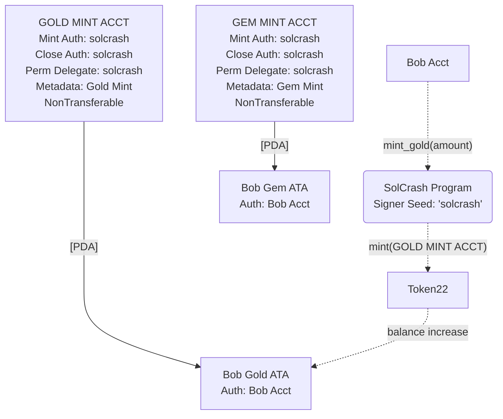
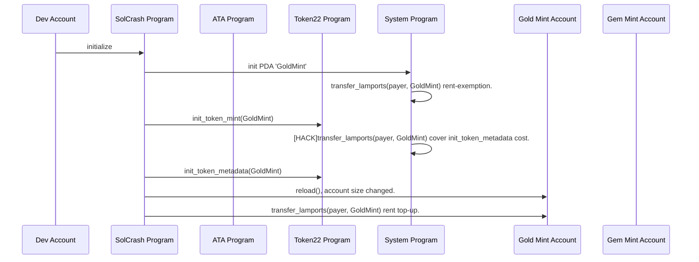

# Solana Crashers On-Chain
This is the on-chain counterpart for a [modified version of Dragon Crashers](https://github.com/kilogold/SolanaCrashers)

# Tests (WIP):
* Contract deployment.
* Gold operations.
* Gem operations.

# Deployment Layout
All tokens are (for now) meant to be under control of the token program.
We are modeling a closed-loop economy. We can revisit later as an open-loop economy.

## Token Extensions used
* **Close Authority**: For clean-up (in an unforsseable future).
* **Metadata**: Embedding token info into the Mint.
* **Non-Transferable**: Assets won't be traded in secondary markets.
## Caveats
* `SolCrash Program` will be the Mint (and Burn) authority for these assets. No need to use `Permanent Delegate` extension, because assets are `Non-Transferable`.
* To accelerate development, we'll let players be authority over ATA. They should not be messing with it directly.
  * TODO: Restrict player authority by setting `SolCrash Program` as the authority, and wrapping instructions as CPI's.

# Instructions
## Initialize

# TODO
* New player registration flow.

# FAQ
**Why use Token Accounts instead of storing all player data in a single account?**  
This way some aspects of the game are readily indexed by blockchain scanners, as it adheres to typical token standards.

**How come ATA addresses are being manually derrived, when we have libraries and on-chain programs to do it for us?**  
ATA's are prototypically PDA's of a Mint account. Our Mint accounts are PDA's themselves, making ATA's a *"PDA (Token) of a PDA (Mint)"*. This is a slight deviation from the API's conventions, so we must derive addresses manually.
