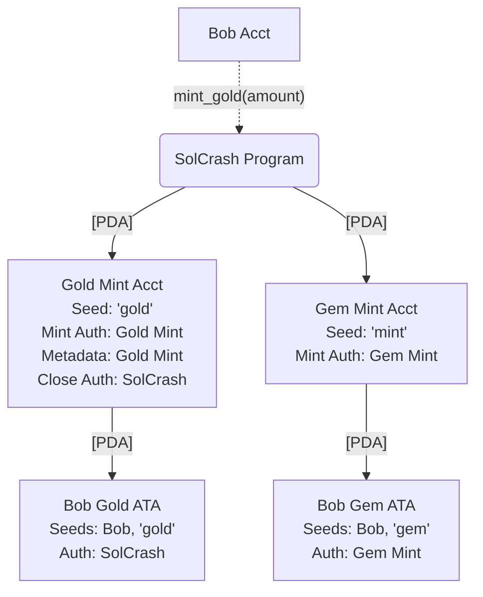

# Solana Crashers On-Chain
This is the on-chain counterpart for a [modified version of Dragon Crashers](https://github.com/kilogold/SolanaCrashers)

# Tests (WIP):
* Contract deployment.
* Gold operations.
* Gem operations.

# Deployment Layout
All tokens are (for now) meant to be under control of the token program.
We are modeling a closed-loop economy. We can revisit later as an open-loop economy.

